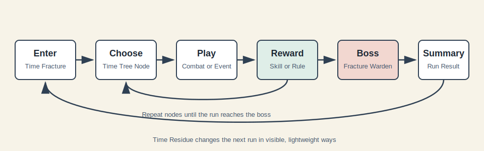

# Game Design

# Chrono Echo: Fractured Realms

## 1. Design Goal

`Chrono Echo: Fractured Realms` 是一款网页端轻量 Roguelike 游戏。玩家进入破碎时间裂隙，在短局战斗中使用时间能力击败敌人，并让每一局的行为在之后的世界中留下影响。

核心目标：

- 单局 10 到 15 分钟，适合网页端休闲游玩。
- 操作直观，玩家在 1 分钟内理解移动、攻击、闪避和时间技能。
- 构筑选择少但有组合空间，不依赖大量难记规则。
- 时间主题必须体现在战斗操作、关卡变化和局后影响中。
- 第一版系统保持简单，但所有内容都以可扩展数据结构组织。

## 2. Player Fantasy

玩家扮演一名“时间锚定者”。世界被时间裂隙撕开，不同时代的城市、神殿、机械遗迹和错误现实混在一起。玩家每次进入裂隙都不是单纯刷怪，而是在修复或扰动一条正在崩坏的时间线。

玩家体验重点：

- 我可以暂停、回溯或复制关键行动。
- 我可以在一局内形成简单但有效的构筑。
- 我上一局做过的事，会被下一局看见。
- 我能主动承担腐化风险，换取更高收益。

## 3. Core Loop



单局流程：

1. 进入时间裂隙。
2. 在时间树地图上选择路线。
3. 进入节点，完成战斗、事件、商店或记忆选择。
4. 获得技能、规则、资源或腐化。
5. 击败本局 Boss。
6. 结算本局行为，生成 Time Residue。
7. 下一局读取残响，让世界发生轻量变化。

设计约束：

- 一局只包含 8 到 10 个节点。
- 战斗节点控制在 60 到 90 秒。
- 每次奖励选择最多展示 3 个选项。
- 每局最多让玩家关注 2 个主动时间技能和 3 到 5 个被动规则。
- 所有局后影响都必须在开局前以清晰文本展示。

## 4. Run Structure

### 4.1 Time Tree Map

时间树是本作的路线选择界面，采用轻量分支结构。

第一版结构：

- 起点节点：固定。
- 中间层：6 到 8 层，每层 2 到 3 个可选节点。
- Boss 节点：固定在末尾。
- 每次只能向下一层相邻节点前进。

节点类型：

| Node Type | First Version Behavior | Future Extension |
| --- | --- | --- |
| Combat | 普通小房间战斗，胜利后获得奖励 | 增加时代主题、地形、挑战词缀 |
| Elite | 更强敌人，奖励更好，腐化收益更高 | 加入特殊敌人和残响触发 |
| Event | 2 到 3 个选择，获得收益或代价 | 加入故事链和阵营影响 |
| Shop | 花费时间碎片购买技能或恢复 | 商人关系、残响价格变化 |
| Memory | 解锁或强化局外记忆 | 角色成长路线 |
| Rest | 恢复生命或降低腐化 | 未来可加入装备修复 |
| Boss | 本局终点战斗 | 多 Boss 池和时间线变体 |

复杂度控制：

- 第一版不做大型地图探索。
- 不做隐藏路径。
- 不做复杂资源管理。
- 路线选择只关注风险、奖励、恢复和构筑方向。

### 4.2 Node Reward Pattern

节点奖励遵循三选一：

- 技能升级：强化主动技能。
- 时间规则：获得被动效果。
- 资源奖励：时间碎片、治疗、降低腐化。

第一版奖励不出现装备栏，不做背包管理。未来如果加入装备，也应保持最多 3 个核心装备槽。

## 5. Combat Design

### 5.1 Camera And Arena

战斗采用 2D 俯视角小房间。

原因：

- 易于在网页端实现。
- 玩家能清楚观察弹幕、敌人位置和时间技能范围。
- 比横版更适合短局和多敌人围攻。
- 后续可扩展地形、陷阱和时代主题房间。

第一版房间规格：

- 单屏或接近单屏，不做滚动大地图。
- 每个房间 1 到 3 波敌人。
- 墙体和障碍物少量出现，避免路径太复杂。
- 战斗结束后自动进入奖励或下一节点。

### 5.2 Player Controls

默认键鼠控制：

| Action | Input | Notes |
| --- | --- | --- |
| Move | WASD | 支持方向键作为备选 |
| Aim | Mouse | 面向鼠标方向 |
| Basic Attack | Left Click | 无资源消耗，短冷却 |
| Dash | Space | 短距离位移，带冷却 |
| Time Skill 1 | Q | 默认 Time Freeze |
| Time Skill 2 | E | 默认 Time Rewind |
| Pause Menu | Esc | 设置、退出本局 |

未来扩展：

- 支持移动端虚拟摇杆和按钮，但不作为第一阶段目标。
- 支持手柄输入，但不作为第一阶段目标。

### 5.3 Player Stats

第一版只保留必要属性：

| Stat | Purpose |
| --- | --- |
| Health | 玩家生命，归零则本局结束 |
| Shield | 临时护盾，用于未来记忆或未来系技能 |
| Move Speed | 移动速度 |
| Attack Damage | 普攻伤害 |
| Attack Cooldown | 普攻间隔 |
| Dash Cooldown | 闪避冷却 |
| Time Energy | 时间技能资源或冷却控制 |
| Corruption | 本局腐化值 |

第一版不做暴击、命中、闪避率、护甲穿透等复杂属性。

### 5.4 Basic Combat Feel

战斗目标：

- 玩家通过走位躲避敌人。
- 普攻击杀基础敌人。
- 时间技能用于关键时刻保命、爆发或创造输出窗口。
- 每场战斗都应该在不打开说明书的情况下可理解。

第一版战斗节奏：

- 普攻频率中等，允许玩家持续输出。
- 敌人攻击前有明显预警。
- 受击反馈清晰，避免突然死亡。
- 时间技能冷却不应过长，让玩家每场战斗都能多次使用。

## 6. Time Skills

时间技能是战斗的核心动词。第一版只实装少量技能，未来通过同一结构扩展。

### 6.1 Skill Slots

第一版：

- 玩家同时携带 2 个主动时间技能。
- 起始技能为 Time Freeze 和 Time Rewind。
- 每局可通过奖励强化技能，但不频繁替换技能，避免学习负担。

未来：

- 可解锁新起始技能。
- 可在开局前选择 2 个主动技能。
- 可加入角色差异，但不做复杂职业系统。

### 6.2 First Version Active Skills

| Skill | Input | Effect | Design Purpose |
| --- | --- | --- | --- |
| Time Freeze | Q | 短时间冻结或大幅减速范围内敌人与弹幕 | 给玩家安全输出窗口 |
| Time Rewind | E | 回到数秒前的位置，并恢复部分近期受到的伤害 | 允许玩家从失误中恢复 |

建议参数：

| Skill | Cooldown | Duration | Notes |
| --- | --- | --- | --- |
| Time Freeze | 10 秒 | 2 秒 | Boss 只受到减速，不完全冻结 |
| Time Rewind | 14 秒 | 回溯 3 秒 | 最多恢复近期损失生命的 60% |

### 6.3 Future Skill Pool

| Skill | Simple Effect | Expansion Hook |
| --- | --- | --- |
| Echo Strike | 下一次攻击在短延迟后重复一次 | 可扩展为复制技能、复制召唤物 |
| Delay Mark | 标记敌人，伤害在 2 秒后爆发 | 可扩展为连锁爆炸或延迟治疗 |
| Time Anchor | 放置锚点，再次触发回到锚点 | 可扩展为房间机制和解谜 |
| Accelerate | 加快自身攻速、移速或冷却 | 可扩展为双刃剑，加速敌人换奖励 |

### 6.4 Skill Upgrade Examples

技能升级必须短句可读。

| Upgrade | Applies To | Effect |
| --- | --- | --- |
| Cold Moment | Time Freeze | Freeze 命中敌人时造成 10 点伤害 |
| Wider Field | Time Freeze | 范围增加 42 像素 |
| Borrowed Breath | Time Rewind | 回溯后获得 1.2 秒的一次性护盾 |
| Shorter Loop | Time Rewind | 冷却减少 2 秒 |
| Second Echo | Echo Strike | 复制攻击伤害提高 |

当前 Stage 4C 实装 Cold Moment、Wider Field 和 Borrowed Breath。Shorter Loop 以 Safer Recall 的形式先作为通用 Rewind 冷却升级存在。

## 7. Build System

### 7.1 Build Layers

构筑分为三层，但第一版只让玩家感知前两层：

| Layer | Player Facing? | Role |
| --- | --- | --- |
| Active Skills | Yes | 玩家主动使用的时间能力 |
| Temporal Rules | Yes | 本局被动规则，改变战斗风格 |
| Reality Modifiers | Mostly No | 局后世界变化和残响系统 |

### 7.2 Temporal Rules

Temporal Rules 是轻量被动。每个规则都应该能用一句话解释。

第一版示例：

| Rule | Effect | Build Direction |
| --- | --- | --- |
| Stored Impact | 对冻结敌人的普攻伤害提高 | Freeze 输出 |
| Emergency Loop | 生命低于 35% 时 Time Rewind 冷却加快 | 生存 |
| Fast Timeline | 闪避后立刻刷新普攻 | 走位输出 |
| Split Second | 使用时间技能后下一次普攻造成额外伤害 | 技能连携 |
| Risky Correction | 腐化越高，时间技能冷却越短 | 高风险高收益 |

当前 Stage 4A 实装前四条规则，先验证“少量规则改变战斗节奏”的体验。Risky Correction 依赖腐化系统，留到 Time Residue 和 Corruption 阶段。

限制：

- 第一版每局最多 5 个 Temporal Rules。
- 同类规则最多叠加 2 次。
- 不做长文本牌组，不做弃牌抽牌系统。

Stage 4B 起，奖励系统会在发放前检查这些限制。已达上限的 Rule 不再进入三选一，系统会用简单 Upgrade 或 Recovery 保持选择数量稳定。

### 7.3 Era Tags

时代标签用于内容扩展，不在第一版中制造复杂克制链。

| Tag | Style | First Version Use |
| --- | --- | --- |
| Ancient | 近战、格挡、诅咒、仪式 | 技能主题和敌人外观 |
| Modern | 枪械、爆破、无人机 | 敌人弹道和事件 |
| Future | 护盾、激光、重力、AI | 防御和控制 |
| Corrupted | 错误现实、异常收益 | 高风险奖励 |

第一版只将标签作为奖励和关卡主题的分类。未来再加入更深联动。

## 8. Time Residue System

### 8.1 Design Intent

Time Residue 是本作核心差异点。它让玩家觉得上一局真的影响了下一局，但不能让玩家觉得被惩罚或被复杂规则绑住。

原则：

- 每局结束生成 1 到 3 条残响。
- 每条残响持续 1 到 3 局。
- 开局前明确展示本局生效的残响。
- 残响同时提供变化和机会，避免纯负面。
- 玩家未来可以通过资源稳定或移除一条不想要的残响。

### 8.2 First Version Residue Categories

| Category | Trigger | Example Effect |
| --- | --- | --- |
| Combat Habit | 某类技能使用频繁 | 敌人获得轻微抗性，但对应反制奖励出现率提高 |
| Route Habit | 经常选择商店、事件或精英 | 对应节点在下局更常出现或价格变化 |
| Corruption Exposure | 高腐化通关或死亡 | 下局出现 Error Elite，但奖励稀有度提高 |
| Death Echo | 玩家死亡位置和死因 | 下局可能出现模仿该死亡方式的回响敌人 |
| Mercy Or Harm | 事件中帮助或牺牲 NPC | 改变商店价格、事件结果或支援概率 |

### 8.3 First Version Residue Examples

| Residue | Trigger | Duration | Effect |
| --- | --- | --- | --- |
| Frozen Timeline | 一局内多次使用 Time Freeze | 2 局 | 部分敌人减速抗性提高，但 Freeze 升级出现率提高 |
| Broken Recall | 频繁使用 Time Rewind 后死亡 | 1 局 | 出现一个 Death Echo 敌人，击败后获得额外记忆碎片 |
| Merchant Memory | 在商店消费较多 | 2 局 | 商店多 1 个商品，但第一件商品价格提高 |
| Corrupted Signal | 腐化高于 75 结算 | 1 局 | 下局精英节点奖励更好，但会出现异常弹幕 |
| Saved Witness | 事件中救助 NPC | 3 局 | 随机事件更容易出现正向选择 |

当前 Stage 5A 先实装更轻量的正向残响：Victory Echo、Last Stand Memory、Frozen Timeline、Recall Trace 和 Merchant Memory。腐化、死亡回响敌人和负面残响留到后续阶段。

### 8.4 Residue Data Model

残响应以数据定义，避免硬编码。

```ts
type ResidueDefinition = {
  id: string;
  name: string;
  category: "combat" | "route" | "corruption" | "death" | "story";
  trigger: ResidueTrigger;
  durationRuns: number;
  visibleText: string;
  effects: ResidueEffect[];
  maxStacks: number;
};
```

第一版只需要支持：

- 修改敌人属性。
- 修改奖励权重。
- 修改节点权重。
- 注入一个特殊敌人或事件。

未来可扩展：

- 多局故事链。
- 玩家之间的幽灵时间线。
- 季节性残响。
- 不同角色的个人残响。

## 9. Corruption System

### 9.1 Design Intent

腐化是玩家主动承担风险的旋钮，不是隐藏惩罚。

腐化来源：

- 选择 Corrupted 奖励。
- 在事件中选择高收益选项。
- 使用某些强力时间修正。
- 击败特殊敌人后吸收异常。

腐化收益：

- 更高稀有奖励概率。
- 更多时间碎片。
- 更容易触发特殊敌人和隐藏事件。

### 9.2 First Version Thresholds

| Corruption | State | Effect |
| --- | --- | --- |
| 0 到 24 | Stable | 无额外变化 |
| 25 到 49 | Unstable | 敌人生命小幅提高，奖励质量小幅提高 |
| 50 到 74 | Fractured | 出现异常弹幕或额外敌人，稀有奖励提高 |
| 75 到 100 | Critical | 可能出现 Error Elite，Boss 获得额外招式，奖励最好 |

复杂度控制：

- 腐化效果只在结算、节点和少量战斗事件中体现。
- 不做大量随机负面状态。
- UI 必须清楚展示当前阈值和下一阈值效果。

## 10. Enemies

### 10.1 Enemy Roles

第一版只需要少量敌人角色。

| Enemy Role | Behavior | Purpose |
| --- | --- | --- |
| Chaser | 追向玩家，近距离攻击 | 迫使玩家移动 |
| Shooter | 保持距离，发射可躲弹幕 | 训练走位 |
| Guard | 移动慢，生命高，攻击前摇明显 | 制造空间压力 |
| Drone | 小型快速敌人，生命低 | 提供爽快击杀 |
| Error Elite | 拥有一条时间异常规则 | 展示核心特色 |

### 10.2 Error Elite Rules

第一版 Error Elite 只选一种异常规则。

| Rule | Effect | Notes |
| --- | --- | --- |
| Death Marker | 攻击玩家上一局死亡位置附近 | 需要可视化预警 |
| Echo Shot | 偶尔复制上一次弹幕 | 弹幕数量要受限制 |
| Frozen Skin | 被冻结时间缩短 | 搭配 Frozen Timeline 残响 |

暂不实现：

- 输入延迟敌人。
- UI 操控敌人。
- 读取玩家真实输入模式的高级 AI。

这些设计有特色，但第一版容易造成挫败，应作为后续实验内容。

## 11. Boss Design

### 11.1 First Boss: Fracture Warden

Fracture Warden 是第一版 Boss，代表时间裂隙守卫。

战斗目标：

- 验证玩家是否掌握走位、闪避、Freeze 和 Rewind。
- 根据腐化阈值增加少量变化。
- 战斗时长控制在 2 到 3 分钟。

技能组：

| Attack | Behavior | Counterplay |
| --- | --- | --- |
| Clock Sweep | 扇形横扫，前摇明显 | 走位或 Dash |
| Delayed Strike | 地面出现标记，短延迟后爆炸 | 离开标记范围 |
| Time Pulse | 释放环形弹幕 | Freeze 弹幕或穿缝躲避 |
| Critical Echo | 高腐化时复制一次上一招 | 注意 Boss 读条 |

Boss 不应完全免疫时间技能。第一版规则：

- Time Freeze 对 Boss 只造成 50% 减速。
- Time Rewind 对玩家完整生效。
- 延迟伤害和复制攻击对 Boss 正常生效，但数值需受平衡控制。

## 12. Events And Shops

### 12.1 Event Design

事件节点保持短文本和明确选择。

示例事件：

| Event | Choice A | Choice B |
| --- | --- | --- |
| Broken Clock | 获得时间碎片 | 增加腐化并获得技能升级 |
| Lost Witness | 救助 NPC，获得 Saved Witness 残响 | 放弃救助，获得即时奖励 |
| Future Cache | 花费生命开启奖励 | 离开并降低腐化 |

每个事件最多 3 个选择。第一版不做长剧情分支。

### 12.2 Shop Design

商店出售：

- 技能升级。
- Temporal Rule。
- 治疗。
- 降低腐化。

第一版商店每次展示 4 个商品。未来可由残响、NPC 关系和时代主题修改库存。

## 13. Meta Progression

### 13.1 Memory System

Memory 是局外成长，不做传统等级碾压。

第一版记忆类型：

| Memory | Unlock Condition | Effect |
| --- | --- | --- |
| Ancient Reflex | 完成 3 次近战相关奖励 | Dash 冷却小幅降低 |
| Future Shield | 第一次击败 Future 主题精英 | 开局获得少量护盾 |
| Death Memory | 死亡 3 次 | 开局可预览一个残响 |
| Merchant Link | 商店消费累计达到阈值 | 商店第一轮刷新价格降低 |

原则：

- 记忆主要解锁选择和轻微便利。
- 不让新玩家因为数值不足而无法通关。
- 每次解锁都应清楚说明用途。

## 14. User Experience

### 14.1 Main Screens

第一版界面：

- Main Menu：开始游戏、记忆、设置。
- Timeline Report：开局前展示当前残响和腐化历史。
- Time Tree：选择节点路线。
- Combat HUD：生命、技能冷却、腐化条、当前目标。
- Reward Screen：三选一奖励。
- Run Summary：结算、残响生成、记忆进度。

### 14.2 Feedback Rules

- 敌人攻击前必须有预警。
- 时间技能必须有明显范围和持续时间反馈。
- Rewind 必须显示回溯轨迹或锚点提示。
- 残响影响必须在进入本局前展示。
- 腐化阈值变化必须有提示，但不打断战斗。

## 15. Content Scope

### 15.1 MVP Content

第一版可玩目标：

- 1 个角色。
- 2 个主动时间技能。
- 5 到 8 个 Temporal Rules。
- 5 种普通敌人。
- 1 种 Error Elite。
- 1 个 Boss。
- 6 到 8 个事件。
- 1 个商店类型。
- 5 到 8 条 Time Residue。
- 本地存档。

### 15.2 Not In MVP

第一版暂不做：

- 多角色。
- 多武器背包。
- 复杂装备系统。
- 大地图探索。
- 联机。
- 排行榜。
- AI 生成关卡。
- 输入干扰类敌人。
- 大量剧情文本。

## 16. Expansion Strategy

后续扩展优先通过数据新增内容，而不是重写核心系统。

扩展方向：

- 新时代主题房间。
- 新主动技能。
- 新 Temporal Rules。
- 新 Residue。
- 新 Boss。
- 新事件链。
- 新记忆。
- 每季一组特殊裂隙规则。

扩展时必须继续遵守：

- 每个新机制一句话能解释。
- 新内容能进入现有节点、奖励、残响或敌人框架。
- 不为了扩展牺牲单局节奏。
